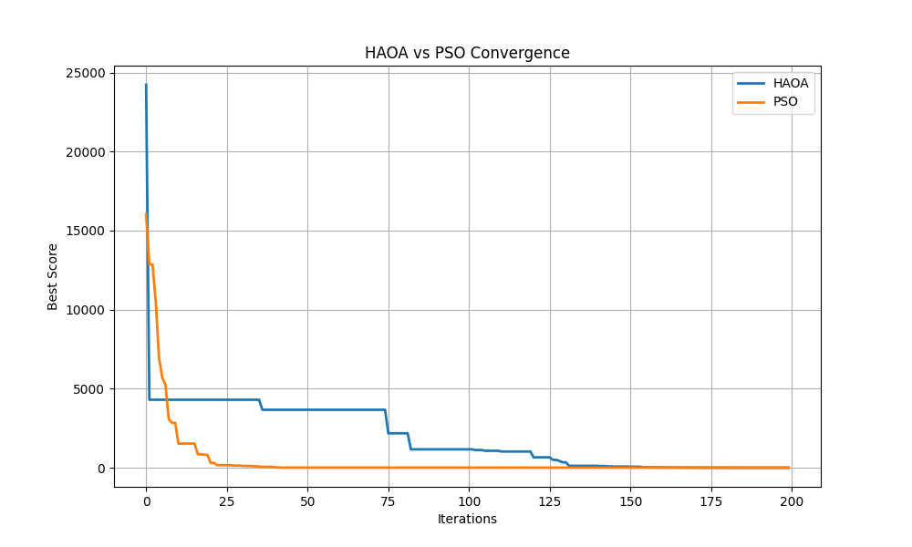

# HAOA — Hybrid Adaptive Optimization Algorithm

HAOA (Hybrid Adaptive Optimization Algorithm) is a research-oriented hybrid metaheuristic optimization framework developed for solving difficult nonlinear and multimodal optimization problems.

The framework combines:

- Adaptive learning
- Velocity-based optimization
- Mutation refinement
- Elite exploitation
- Lévy-flight exploration
- Dynamic convergence control

HAOA is benchmarked against Particle Swarm Optimization (PSO) on multiple standard optimization landscapes.

---

# Features

- Adaptive optimization
- Benchmark testing framework
- HAOA vs PSO comparison
- CSV result export
- PNG convergence plots
- Convergence analysis
- Research-style experimentation
- Dataset optimization support
- Visualization modules
- Modular benchmark architecture

---

# Algorithms Included

- HAOA (Hybrid Adaptive Optimization Algorithm)
- Particle Swarm Optimization (PSO)

---

# Benchmark Functions

The framework currently supports:

- Sphere
- Rastrigin
- Rosenbrock
- Ackley
- Griewank

These benchmarks include:
- unimodal landscapes
- multimodal landscapes
- deceptive valleys
- rugged optimization surfaces

---

# Project Structure

```text
HAOA/
│
├── algorithm/
│   └── haoa.py
│
├── benchmark_functions/
│   ├── sphere.py
│   ├── rastrigin.py
│   ├── ackley.py
│   ├── griewank.py
│   └── rosenbrock.py
│
├── comparison_algorithms/
│   └── pso.py
│
├── datasets/
│   └── sample_dataset.py
│
├── experiments/
│   ├── dataset_comparison.py
│   ├── full_runner.py
│   └── benchmark_manager.py
│
├── visualization/
│   ├── advanced_plots.py
│   └── final_comparison.py
│
├── results/
│   ├── csv/
│   ├── figures/
│   └── benchmark_comparison.csv
│
└── README.md
```

---

# Installation

Clone the repository:

```bash
git clone https://github.com/aasifsajad0100/HAOA-Hybrid-Adaptive-Optimization-Algorithm.git
```

Move into the project directory:

```bash
cd HAOA-Hybrid-Adaptive-Optimization-Algorithm
```

Install dependencies:

```bash
pip install -r requirements.txt
```

---

# Run Benchmark Tests

Run the full benchmark framework:

```bash
python -m HAOA.experiments.dataset_comparison
```

Or run the complete experiment pipeline:

```bash
python -m HAOA.experiments.full_runner
```

---

# Generated Outputs

The framework automatically generates:

- CSV benchmark reports
- Convergence plots
- Benchmark comparison graphs
- Runtime statistics
- Optimization logs

Generated outputs are stored in:

```text
results/
```

and

```text
HAOA/results/
```

---

# Sample Benchmark Results

| Function | HAOA | PSO | Winner |
|---|---|---|---|
| Rastrigin | 242.11 | 74.56 | PSO |
| Ackley | 1.70 | 13.94 | HAOA |
| Griewank | 0.051 | 0.016 | PSO |
| Rosenbrock | 119.00 | 3142.11 | HAOA |

---

# Sample Convergence Plot



---

# Research Motivation

HAOA was designed to improve optimization performance on difficult nonlinear and multimodal landscapes by combining:

- adaptive exploration
- guided exploitation
- stochastic mutation
- dynamic learning strategies
- stagnation escape mechanisms

The algorithm is especially effective on:
- deceptive valleys
- rugged landscapes
- highly nonlinear optimization problems

---

# Future Improvements

Planned future extensions include:

- Genetic Algorithm comparison
- Differential Evolution integration
- Statistical benchmarking
- Multi-objective optimization
- Deep learning hyperparameter optimization
- Parallel optimization support

---

# Author

Aasif Sajad

GitHub:
https://github.com/aasifsajad0100
